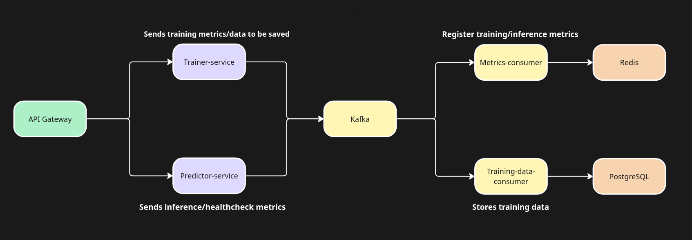
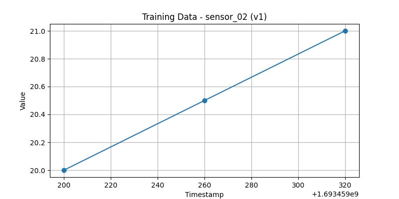
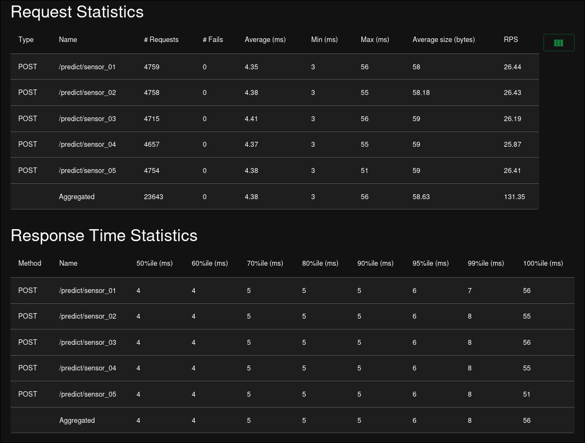

# Anomaly detection API

This project is a **scalable anomaly detection platform** built with:

- **Gin** - API Gateway
- **FastAPI** – predictor, training and metrics services
- **Kafka** – asynchronous event streaming
- **Redis** – metrics storage
- **PostgreSQL** – persistent training data storage
- **Docker Compose** – service orchestration

It contains the following services:

1. **API Gateway** – single entry point for training, prediction, plotting, and metrics. (1 instance)
2. **Trainer Service** – trains models for time series anomaly detection. (4 workers)
3. **Predictor Service** – performs predictions using trained models. (10 workers)
4. **Metrics Consumer** – consumes Kafka metrics events and updates Redis. (2 partitions)
5. **Training Data Consumer** – consumes Kafka training data events and stores them in PostgreSQL. (1 partition)
6. **Redis** – stores metrics in-memory for quick access. (1 instance)
7. **Kafka Cluster** – processes asynchronous messages. (2 instances)

## 📌 Architecture



## Implemented Enhancements
- **Performance Testing:** Included Locust benchmark results
- **Preflight Validation:** Validation for insufficient, constant or invalid data
- **Visualization Tool:** Endpoint that plots training data
- **Model Versioning:** Implemented retraining of the same `series_id`

## Setup

### 1. Clone the repository
```
git clone https://github.com/pcrespan/anomaly_detection.git
cd anomaly_detection
```

### 2. Create your env file
```
cp .env.example .env
```

### 3. Build services with Docker compose
```
docker-compose build --no-cache
```

### 4. Start services
```
docker-compose up
```

## Usage
You can either run the demonstration script:
```
sh demo.sh
```
Or manually send requests to the API Gateway.

### 1. Train a model
```
curl -X POST "http://localhost:8080/fit/sensor_01" \
  -H "Content-Type: application/json" \
  -d '{
    "timestamps": [1693459200, 1693459260, 1693459320],
    "values": [10.0, 10.5, 11.0]
  }'
```
### 2. Run a prediction
```
curl -X POST "http://localhost:8080/predict/sensor_01" \
  -H "Content-Type: application/json" \
  -d '{
    "timestamp": 1693460000,
    "value": 10.5
  }'
```
### 3. Plot training data
```
curl -X GET "http://localhost:8080/plot?series_id=sensor_01&version=v1" \
  --output plot.png
```
This will save the plot as `plot.png` in your current directory. Output example below.



### 4. Healthcheck
```
curl -X GET "http://localhost:8080/healthcheck"
```
Example output:
```
{
  "inference_latency_ms": {
    "avg": 0.35,
    "p95": 0.6
  },
  "model_usage": {
    "sensor_01": "391",
    "sensor_02": "408",
    "sensor_03": "380",
    "sensor_04": "380",
    "sensor_05": "374"
  },
  "series_trained": 5,
  "system_metrics": {
    "predictor": {
      "cpu_percent": 15.5,
      "load_avg": [
        1.9287109375,
        1.376953125,
        1.4716796875
      ],
      "memory_percent": 56.3
    },
    "trainer": {
      "cpu_percent": 25.5,
      "load_avg": [
        1.9287109375,
        1.376953125,
        1.4716796875
      ],
      "memory_percent": 56.4
    }
  },
  "throughput": {
    "predictor": {
      "avg_per_minute": 101.53
    },
    "trainer": {
      "avg_per_minute": 1
    }
  },
  "training_latency_ms": {
    "avg": 0.77,
    "p95": 0
  }
}
```
## Load testing with Locust

### 1. Install Locust
```
pip install locust
```

### 2. Run Locust
```
cd benchmark
locust -f locustfile.py --host http://localhost:8080
```

### 3. Open the web UI
On your browser, navigate to:
```
http://localhost:8089
```
Configure number of users, ramp up and duration, then start the test.

## Benchmark results
The full report can be found at `static/results`
- 100 Users, 20 ramp up



## 🧩 Notes
- The `/plot` endpoint is available through the `API Gateway` and generates plots from data stored in PostgreSQL.

- Metrics are stored in `Redis` for fast retrieval and are refreshed via `Kafka` events.

- Training data is persisted in `PostgreSQL` for long-term storage.

- The `old` folder contains the previously used FastAPI gateway and Dockerfile. The gateway was changed from FastAPI (Python) to Gin (Go) due to performance reasons. While FastAPI's average response time was more than 200ms, Gin's average response time is below 5ms. The benchmark results for FastAPI can be found at `static/py_benchmark_100.jpg`